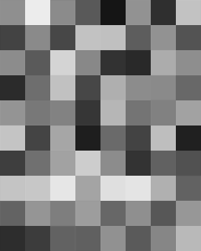

# Re-implementation of Variational Neural Cellular Automata

The repository contains code for the reproduction of the results from "Variational Neural Cellular Automata" [1].

The array and autograd library [JAX](https://github.com/google/jax), the neural network library [equinox](https://github.com/patrick-kidger/equinox), the optimization library [optax](https://github.com/deepmind/optax) and the tensor operation library [einops](https://github.com/arogozhnikov/einops) are used.

The results using the binarized MNIST dataset [2] are the main points of the paper reproduced.

<!--  -->



## Results

Our model achieves the following performance on :

### [Image Generation on Binarized MNIST](https://paperswithcode.com/sota/image-generation-on-binarized-mnist)

| Model name         | IWELBO evaluated on the test set using 128 importance weighted samples. |
| --------------- |----------- |
| BaselineVAE     | -84.64 nats  |
| DoublingVNCA    | -84.15 nats  |
| NonDoublingVNCA | -89.3 nats |

<!-- 📋  Include a table of results from your paper, and link back to the leaderboard for clarity and context. If your main result is a figure, include that figure and link to the command or notebook to reproduce it.--> 

## Figures

The different figures from the paper can be reproduced using the following scripts:

| Figure         | Script to reproduce the figure |
| --------------- |----------- |
| Figure 2     | `sample.py`  |
| Figure 3    | `sample.py`  |
| Figure 4 | `latent_interpolate.py` and `t-sne.py` |
| Figure 5 | `damage_recovery.py` |
| Figure 6 | `linear_probe_figure.py` |
| Figure 7 | `latent_viz.py` |

## Requirements

To install requirements locally, run the following command:

```setup
pip install -e .
```

## Training

To train a model using 8 v3 TPUs available on [Kaggle](https://www.kaggle.com/), import the script `main-train.py` as a kaggle notebook under:

+ Create -> New Notebook -> File -> Import Notebook


Then select the TPU accelerator:


The script can then be run as a notebook.

## Evaluation

To evaluate a trained model, the script to be used is `eval.py`. The script should be loaded onto Kaggle in the same way as the training script.

## Tests

To run a few tests that test the model output shape and the doubling operation, run the following command:

```pytonn
pytest tests.py
```

## References

This work was presented as a poster at [NeurIPS 2023](https://neurips.cc/virtual/2023/poster/74151) as a submission to the [ML Reproducibility Challenge 2022](https://paperswithcode.com/rc2022).

[1] R. B. Palm, M. G. Duque, S. Sudhakaran, and S. Risi. Variational Neural Cellular Automata. ICLR 2022

[2] H Larochelle and I Murray. The neural autoregressive distribution estimator.